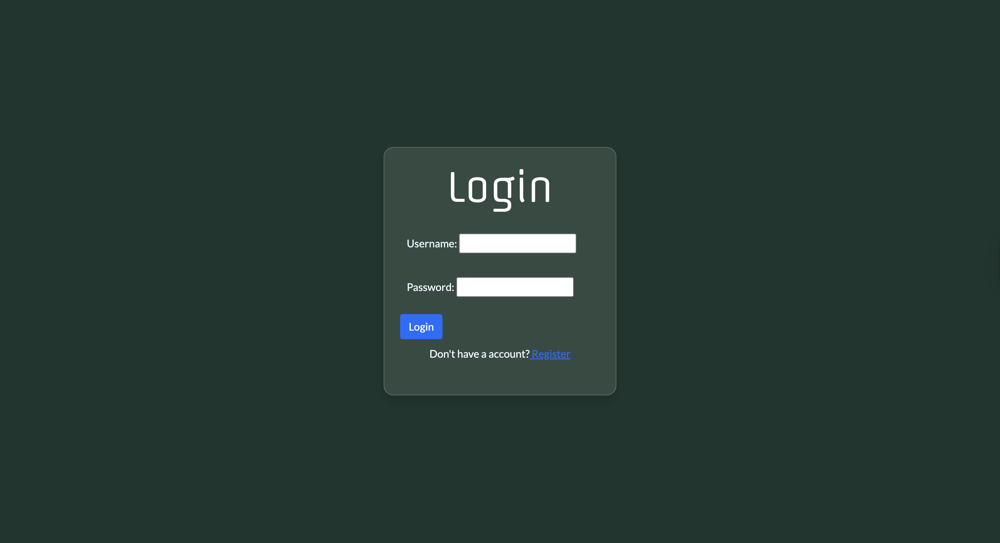
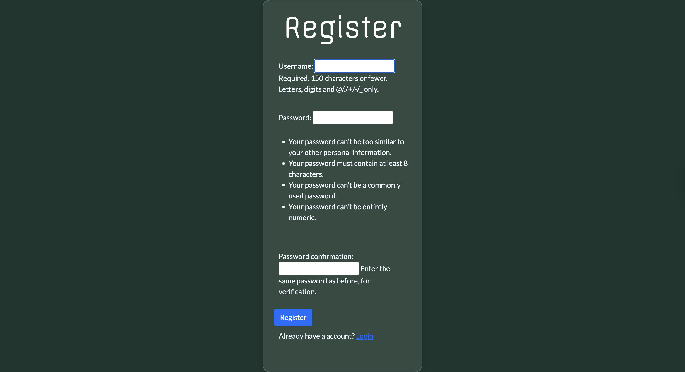
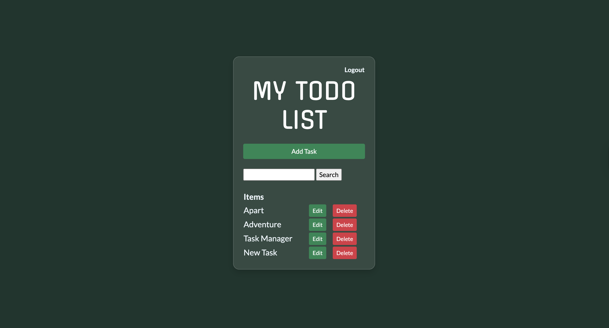
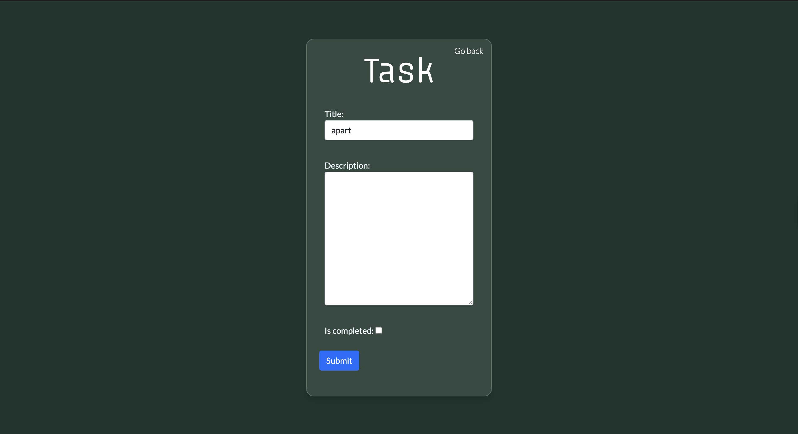
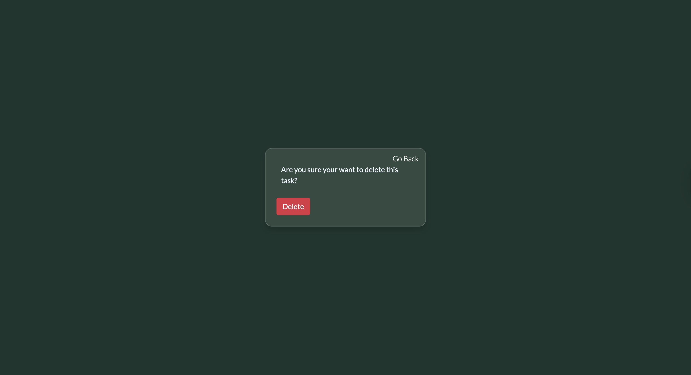

# Todo-WebApp with Django
A simple and efficient _To-Do Web Application_ build with **Django**. This app allows users to manage their tasks effectively by adding, updating and deleting them. It provides an intuitive interface. 

## Installation

### Prerequisites
Make sure your have python 3.8+ and pip installed on your system.

### Steps to Run Locally 
1. _Clone The Repository_ 
```
git clone https://github.com/Turjo47/Todo-webApp.git
```
2. _activate the virturl environment(**todovenv**) and activate it_ :
> Windows:
```
todovenv\Scripts\activate
```
>MacOs:
```
source todovenv/bin/activate
```
3. _install dependencies from **requirements.txt**_ :
```
pip install -r requirements.txt
```
4. _Apply Database migrations_:
```
python manage.py migrate
```
5. _Run the development server_:
```
python manage.py runserver
```
6. Open your browser and visit:
```
http://127.0.0.1:8000
```
### Screenshots





